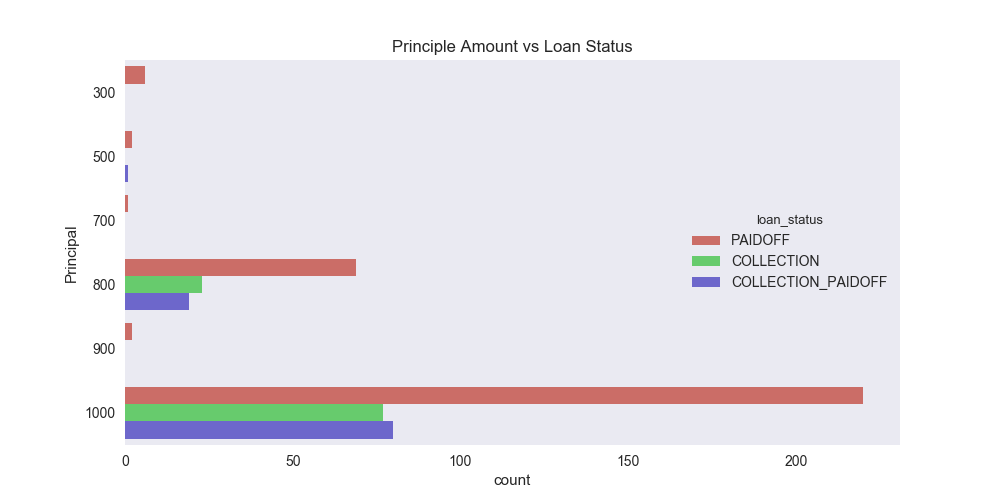
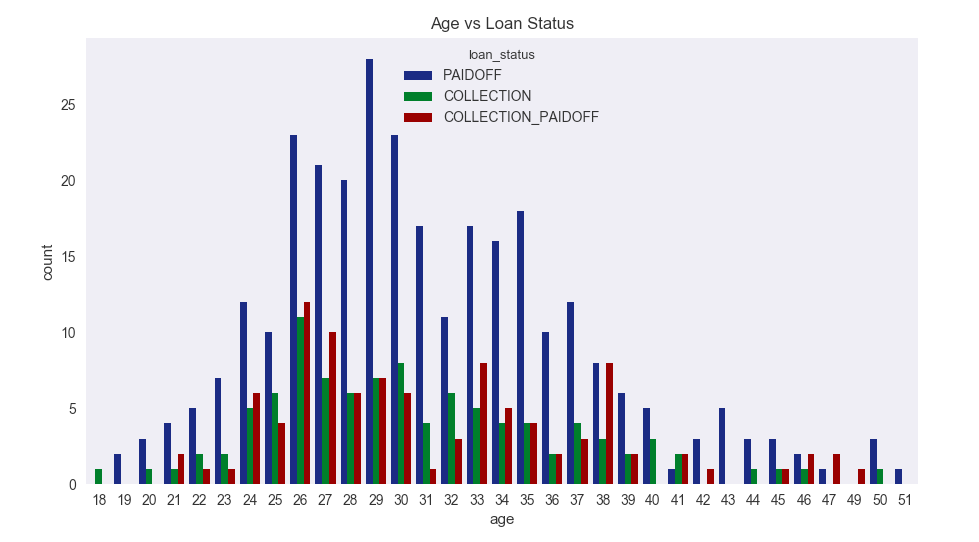
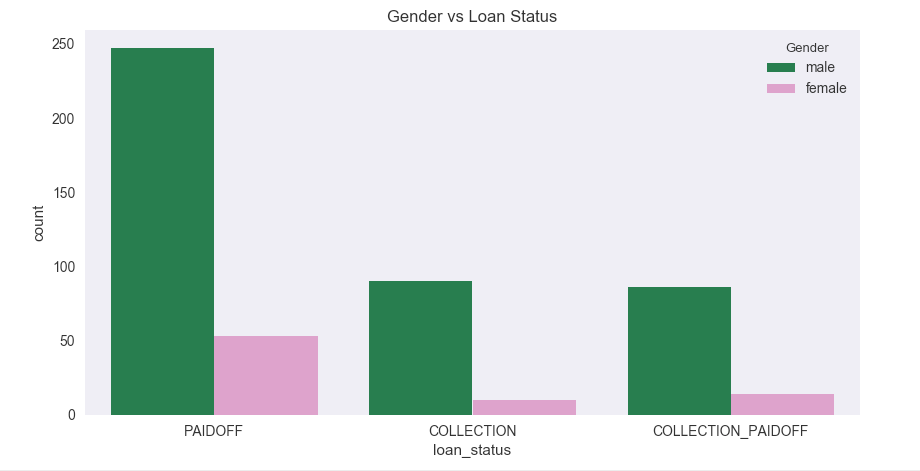
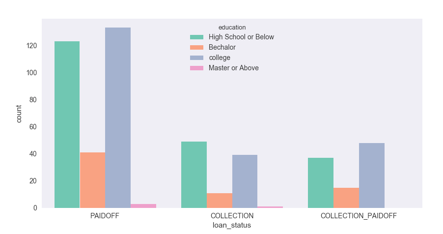
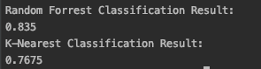
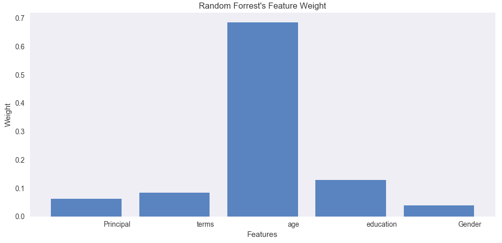

# Loan_Payout_Classification
This script utilizes machine learning classification algorithms to train on the data of loans dispursed to different people. 
Throughout the script, several graphs are generated to visualize the data. 

### Data
The criteria used for machine learning algorithms are: `Principal Amount, Loan Term, Age, Education, and Gender`.
 
The target data is `loan status` which is composed of: `PAID OFF, COLLECTION, COLLECTION PAID OFF`.

### Data Visualization
First graph shows how loan status is distributed amongst different loan amounts. 

The second graph shows how loan status is distributed amongst different age groups. 

The third graph shows how loan status is distributed amongst different gender groups. 

The last graph that summarizes the data, shows how loan status is distributed amongst
different educational levels. 

### Training and Testing
Since the goal is to identify the loan status given multiple criteria and assign the end result to a set category, 
Classification Algorithms would potentially fit the best. 
 
The results of using `Random Forrest` and `K-Nearest Neighbor`: 

This shows that `Random Forrest` is more successful in predicting loan status. 
Upon further examination, the following graph shows weight distribution upon criteria. 
 

